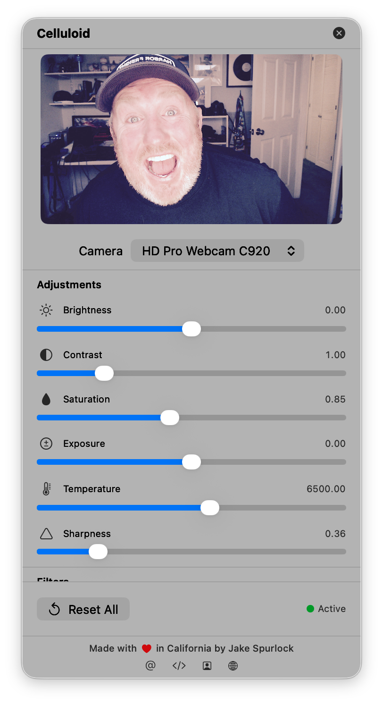

# Celluloid

A macOS virtual camera app that captures your webcam feed, applies real-time filters, and outputs to a virtual camera for use in video conferencing apps like Zoom, Google Meet, and FaceTime.

<p align="center">
  
</p>

## Features

- **Real-time filters** - Noir, Chrome, Fade, Instant, Mono, Process, Tonal, Transfer, and Black Mist (Tiffen Pro-Mist emulation)
- **Adjustments** - Brightness, contrast, saturation, exposure, color temperature, and sharpness
- **Persistent settings** - Your adjustments and filter selection are saved between sessions
- **Smart activation** - Camera only runs when the preview window is open or an external app is using the virtual camera
- **Mirrored preview** - Preview shows a mirrored view like looking in a mirror
- **Menubar app** - Lives in your menubar for quick access
- **Works everywhere** - Compatible with Zoom, Google Meet, FaceTime, Photo Booth, and any app that supports camera input

## Architecture

```
┌─────────────────────┐                        ┌──────────────────────────┐
│   Celluloid App     │                        │   CMIO Extension         │
│                     │   CoreMediaIO          │                          │
│  - Captures camera  │   Sink Stream          │  Sink Stream (input)     │
│  - Applies filters  │ ──────────────────────▶│         │                │
│  - Sends to sink    │                        │         ▼                │
│                     │                        │  Source Stream (output)  │
│                     │                        │         │                │
└─────────────────────┘                        │         ▼                │
                                               │  Video Apps (Zoom, etc)  │
                                               └──────────────────────────┘
```

## Requirements

- macOS 15.0 or later
- Camera access permission

## Installation

### From Source
1. Clone the repository
2. Open `Celluloid.xcodeproj` in Xcode
3. Build with Release configuration (⌘+Shift+B) - automatically installs to `/Applications`
4. Launch the app from `/Applications` and approve the system extension when prompted
5. Select "Celluloid Camera" in your video app's camera settings

### Usage
- Click the camera icon in your menubar to open the control panel
- Adjust sliders and select filters - changes apply in real-time
- Close the panel when done - the virtual camera continues working for external apps

## Future Enhancements

### Performance Optimizations

1. **Skip CGImage conversion** - Render CIImage directly to CVPixelBuffer instead of going through CGImage, eliminating an intermediate conversion step.

2. **CVPixelBufferPool** - Reuse pixel buffers from a pool instead of creating new ones each frame, reducing memory allocation overhead.

3. **IOSurface-backed buffers** - Use IOSurface for zero-copy frame transfer between the app and extension, avoiding memory copies entirely.

4. **Metal rendering** - Use Metal/GPU for filter processing instead of CPU-based Core Image rendering for better performance on complex filters.

### Feature Ideas

- Custom LUT (Look-Up Table) support for advanced color grading
- Face tracking and background blur
- Virtual backgrounds
- Recording/snapshot capability
- Preset management for filter combinations
- Keyboard shortcuts for quick filter switching

## Author

Made with ❤️ in California by [Jake Spurlock](https://jakespurlock.com)

- [Twitter](https://twitter.com/whyisjake)
- [GitHub](https://github.com/whyisjake)
- [LinkedIn](https://www.linkedin.com/in/jakespurlock)

## License

MIT
